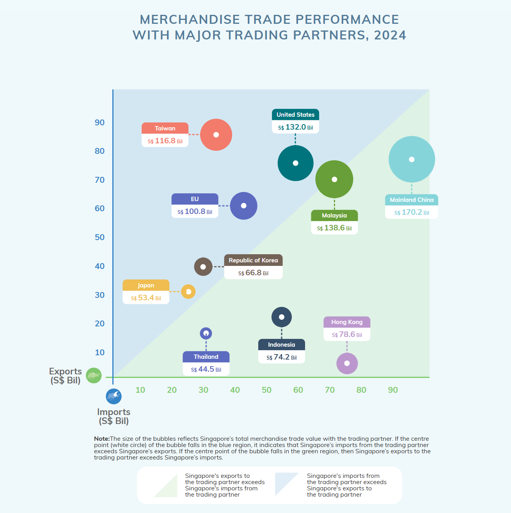
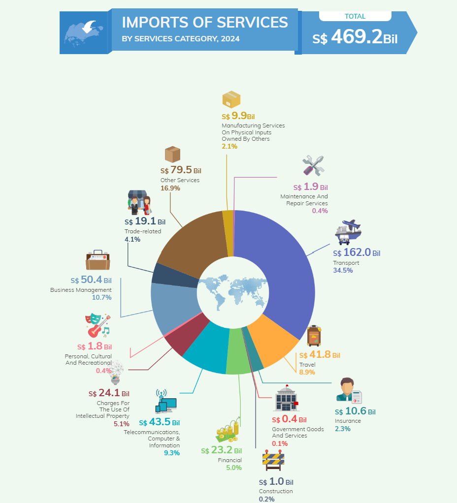

# **1.Overview**

The **Singapore Department of Statistics (SingStat)** website provides official data on Singapore’s economy, society, and trade through interactive dashboards, infographics, and datasets. Its **International Trade** section presents key trade figures, including exports, imports, and major trading partners, using structured visualizations. For this take-home exercise, I am evaluating three of these visualizations to assess their clarity, design, and effectiveness. By identifying strengths and suggesting improvements, this analysis aims to enhance the presentation of trade data, making it more accessible and engaging for a wider audience.

# **2.Getting Started**

## 2.1 Load Required Libraries

Before starting, install and load the necessary R packages:

```{r}

# Load libraries
library(tidyverse)   # Data wrangling and visualization
library(readxl)      # Read Excel files
library(lubridate)   # Work with date formats
library(janitor)     # Clean column names
library(ggplot2)     # Visualization
library(tsibble)     # Time-series data wrangling
library(forecast)    # Time-series forecasting
library(feasts)      # Time-series decomposition
library(readxl)
```

## 

| Description | Library |
|------------------------------------|------------------------------------|
| Core (Data & Visualization) | [tidyverse](https://www.tidyverse.org/) , [ggplot2](https://ggplot2.tidyverse.org/) , [ggrepel](https://cran.r-project.org/web/packages/ggrepel/vignettes/ggrepel.html) , [patchwork](https://patchwork.data-imaginist.com/) |
| Styling & Themes | [ggthemes](https://yutannihilation.github.io/allYourFigureAreBelongToUs/ggthemes/) , [hrbrthemes](https://rdrr.io/cran/hrbrthemes/) |
| Interactivity | [ggiraph](https://davidgohel.github.io/ggiraph/) , [plotly](https://plotly.com/r/) , [DT](https://rstudio.github.io/DT/) |
| Statistical & Model Insights | [ggdist](https://mjskay.github.io/ggdist/) , [ggridges](https://cran.r-project.org/web/packages/ggridges/vignettes/introduction.html) , [ggstatsplot](https://indrajeetpatil.github.io/ggstatsplot/) , [performance](https://easystats.github.io/performance/) , [see](https://cran.r-project.org/web/packages/see/index.html) |
| Exploratory & Clustering | [corrplot](https://cran.r-project.org/web/packages/corrplot/vignettes/corrplot-intro.html) , [heatmaply](https://cran.r-project.org/web/packages/heatmaply/vignettes/heatmaply.html) , [GGally](https://cran.r-project.org/web/packages/GGally/index.html) |
| Hierarchical Analysis | [treemap](https://rpubs.com/brandonkopp/creating-a-treemap-in-r) , [treemapify](https://cran.r-project.org/web/packages/treemapify/vignettes/introduction-to-treemapify.html) |

Let us install the above packages using [Pacman](https://rpubs.com/akshaypatankar/594834).The pacman package is used to load required libraries without the need of being sure of having that particular package installed. The functions in this package are easier to use than their equivalent base functions. Coding time required is significantly reduced because of this package.

```{r}
pacman::p_load(tidyverse, ggplot2, ggrepel, patchwork,ggthemes, hrbrthemes,
			   ggiraph, plotly, DT,ggdist, ggridges, ggstatsplot, 
			   performance,readxl, tsibble, feasts, fable, scales)
```

## 2.2 Importing Data

The dataset contains **Singapore’s international trade data**, including **Imports, Domestic Exports, and Re-Exports** from **various trading partners** over multiple years. It provides trade values across different commodities and markets, enabling analysis of trade trends, partner dependencies, and overall merchandise trade performance.

```{r}
# Read each file into a dataframe
commodity_prices <- read_excel("data/Commodity_currentprices.xlsx")
domestic_exports <- read_excel("data/Domestic_exports.xlsx")
imports <- read_excel("data/Import.xlsx")
re_exports <- read_excel("data/Re-exports.xlsx")


```

```{r}
# View the first few rows of each dataset
head(commodity_prices)
head(domestic_exports)
head(imports)
head(re_exports)
```

The **head(re_exports) and other tables** output shows that the dataset contains **metadata rows** at the top, including **Theme, Subject, Topic, and Table Title**, instead of actual trade data. This indicates that **the first few rows are not part of the structured dataset** and must be removed during data wrangling.

```{r}
# Read Excel files (ignoring metadata by skipping rows)
  domestic_exports <- read_excel("data/Domestic_exports.xlsx", skip = 10)  
  imports <- read_excel("data/Import.xlsx", skip = 10)  # Skip metadata
  re_exports <- read_excel("data/Re-exports.xlsx", skip = 10)  # Skip metadata

```

In order to double check that the metadata is removed,

```{r}
# Check first few rows to ensure metadata is removed
head(domestic_exports)
head(imports)
head(re_exports)
```

## 2.3 Data Transformation

The code **transforms trade data into long format** using `pivot_longer()`, ensuring that each row represents a **single trade value per date**. It also **converts the date column** into a `yearmonth` format and selects only relevant columns (`Data Series`, `Date`, and trade values) for further analysis.

```{r}
# Convert data to long format using pivot_longer (Ignore Metadata)
import_long <- imports %>%
  pivot_longer(cols = -`Data Series`, names_to = "Month_Year", values_to = "Import_Value") %>%
  mutate(Date = yearmonth(Month_Year)) %>%
  select(`Data Series`, Date, Import_Value)

export_long <- domestic_exports %>%
  pivot_longer(cols = -`Data Series`, names_to = "Month_Year", values_to = "Export_Value") %>%
  mutate(Date = yearmonth(Month_Year)) %>%
  select(`Data Series`, Date, Export_Value)

re_export_long <- re_exports %>%
  pivot_longer(cols = -`Data Series`, names_to = "Month_Year", values_to = "ReExport_Value") %>%
  mutate(Date = yearmonth(Month_Year)) %>%
  select(`Data Series`, Date, ReExport_Value)
```

```{r}
print(import_long)
print(export_long)
print(re_export_long)
```

The data from 2020 to 2024 is summarized by calculating annual export, re-export, and import values. Export and re-export data are merged to compute **Total Export**, which is then combined with import data. The final dataset categorizes trade values as **"Export"** or **"Import"** for analysis.

```{r}
# Aggregate Data (2020-2024) - Summarizing Trade Data by Year
export_summary <- export_long %>%
  filter(`Data Series` == "Total All Markets") %>%
  mutate(Year = as.integer(substr(Date, 1, 4))) %>%  # Use "Date" instead of "Month_Year"
  filter(Year >= 2020 & Year <= 2024) %>%
  group_by(Year) %>%
  summarise(Annual_Export = sum(Export_Value, na.rm = TRUE))


reexport_summary <- re_export_long %>%
  filter(`Data Series` == "Total All Markets") %>%
  mutate(Year = as.integer(substr(Date, 1, 4))) %>%
  filter(Year >= 2020 & Year <= 2024) %>%
  group_by(Year) %>%
  summarise(Annual_ReExport = sum(ReExport_Value, na.rm = TRUE))

import_summary <- import_long %>%
  filter(`Data Series` == "Total All Markets") %>%
  mutate(Year = as.integer(substr(Date, 1, 4))) %>%
  filter(Year >= 2020 & Year <= 2024) %>%
  group_by(Year) %>%
  summarise(Annual_Import = sum(Import_Value, na.rm = TRUE))

# Merge Export and Import Data
export_total_summary <- export_summary %>%
  left_join(reexport_summary, by = "Year") %>%
  mutate(Total_Export = Annual_Export + Annual_ReExport)

combined_summary <- export_total_summary %>%
  rename(Value = Total_Export) %>%
  mutate(Type = "Export") %>%
  bind_rows(
    import_summary %>%
      rename(Value = Annual_Import) %>%
      mutate(Type = "Import")
  )
```

```{r}
print(export_total_summary)
print(combined_summary)
```

The total trade value is calculated for each year from the combined export and import data. Year-over-year change and percentage growth in trade are computed to analyze trends. The final dataset shows **Total Trade**, absolute change, and percentage change for each year.

```{r}
# Compute Total Trade and Growth Rate
trade_summary <- combined_summary %>%
  group_by(Year) %>%
  summarise(Total_Trade = sum(Value, na.rm = TRUE)) %>%
  arrange(Year)

total_trade_summary <- trade_summary %>%
  arrange(Year) %>%
  mutate(Change = Total_Trade - lag(Total_Trade),
         Change_Perc = round(100 * (Total_Trade - lag(Total_Trade)) / lag(Total_Trade), 1))
```

```{r}
print(trade_summary)
```

# **3.DataVis Makeover**

## 3.1 Total Merchandise Trade at Current Prices, 2020 - 2024

### 3.1.1 Original chart


The chart presents **total merchandise trade at current prices from 2020 to 2024**, breaking it down into **exports and imports** for each year. Each bar represents **export and import values**, with distinct colors for better differentiation. Total trade for each year is highlighted on the right, providing a quick summary of yearly trends. A key takeaway at the bottom shows that **trade increased by 6.6% in 2024**, but **percentage changes for previous years are missing**. While visually engaging, the **stacked horizontal bars make year-over-year comparisons difficult**, and a **line chart** could better illustrate trends over time.

### 3.1.2 Areas of Improvement

**Pros:**

1.  **Clear Representation** – The chart effectively displays yearly trade values for exports and imports.

2.  **Good Use of Color Coding** – Each year is assigned a distinct color, making comparisons easier.

3.  **Annotations for Total Trade** – Each year's total trade value is highlighted separately, making it easy to see overall trends.

4.  **Emphasis on Growth** – The 6.6% increase in 2024 is clearly noted, drawing attention to recent changes.

5.  **Visually Engaging** – The container-like bars align well with the trade theme, making the chart appealing.

**Cons:**

1.  **Too Many Colors** – The use of different colors for each year may be visually overwhelming.

2.  **No Clear Trend Representation** – The bar format makes it hard to see overall trade movement over time.

3.  **Missing Year-over-Year Changes** – Percentage changes for each year (except 2024) are not shown, limiting insights.

4.  **Limited Data Breakdown** – The chart only provides annual values, missing potential trends in monthly or quarterly data.

5.  **Not Interactive** – Users cannot explore the data dynamically, such as hovering over values or filtering by category.

### 3.1.3 Revamp

```{r}
# Load required libraries
library(ggplot2)
library(dplyr)
library(tidyr)
library(scales)  # For formatting numbers

# Compute Total Trade
total_trade_summary <- combined_summary %>%
  group_by(Year) %>%
  summarise(Exports = sum(Annual_Export, na.rm = TRUE),
            Imports = sum(Annual_ReExport, na.rm = TRUE),
            Total_Trade = sum(Trade_Value, na.rm = TRUE))  

# Reshape data for plotting
trade_long <- total_trade_summary %>%
  pivot_longer(cols = c(Exports, Imports, Total_Trade), names_to = "Trade_Type", values_to = "Value")

# Define pastel colors
line_colors <- c("Exports" = "#FF9999",     # Soft Red
                 "Imports" = "#32CD32",     # Soft Green
                 "Total_Trade" = "#6495ED") # Soft Blue

# Create Line Chart
ggplot(trade_long, aes(x = Year, y = Value, color = Trade_Type, group = Trade_Type)) +
  
  # Line chart with points
  geom_line(size = 1.5) +
  geom_point(size = 3) +

  # Apply pastel color scheme
  scale_color_manual(values = line_colors) +

  # Format y-axis (No exponential notation)
  scale_y_continuous(labels = comma) +
  
  # Titles and Labels
  labs(title = "Yearly Trend of Merchandise Trade (2020-2024)",
       x = "Year",
       y = "Trade Value (S$ Billion)",
       color = "Trade Type") +
  
  # Clean theme
  theme_minimal() +
  theme(
    legend.position = "right",  # Keep legend on the right
    legend.title = element_text(face = "bold"),  # Bold legend title
    text = element_text(size = 14)  # Adjust font size for clarity
  )


```

```{r}
# Load required libraries
library(ggplot2)
library(dplyr)
library(tidyr)
library(scales)  # For formatting numbers

# Ensure 'Type' column is not duplicated
#combined_summary <- combined_summary %>%
  #rename(Trade_Value = Value)  # Rename before pivoting to prevent duplication

# Reshape data
trade_long <- combined_summary %>%
  pivot_longer(cols = Trade_Value, names_to = "Category", values_to = "Value", names_repair = "unique")

# Define pastel colors for Import and Export
pastel_colors <- c("Export" = "#D8BFD8",   # Lilac
                   "Import" = "#FFB6C1")  # Light Pink

# Grouped Bar Chart
ggplot(trade_long, aes(x = Year, y = Value, fill = Type)) +
  geom_bar(stat = "identity", position = "dodge") +
  
  # Apply pastel color scheme
  scale_fill_manual(values = pastel_colors) +
  
  # Ensure X-axis is properly formatted
  scale_x_continuous(breaks = seq(min(trade_long$Year), max(trade_long$Year), by = 1)) +
  
  # Format Y-axis to show numbers properly
  scale_y_continuous(labels = comma) +  
  
  # Titles and Labels
  labs(title = "Total Merchandise Trade at Current Prices (2020-2024)",
       subtitle = "Grouped Bar Chart for Clearer Yearly Comparison",
       x = "Year",
       y = "Trade Value (S$ Billion)",
       fill = "Trade Type") +
  
  # Clean theme
  theme_minimal()


```

## 3.2 Merchandise trade performance with major trading partners, 2024

### 3.2.1 Original chart



### 3.2.2 Areas of Improvement

**Pros:**

1.  **Clear Representation of Trade Balance** – The green and blue shaded regions help distinguish whether Singapore exports more or imports more from a trading partner.

2.  **Effective Use of Bubble Size** – The size of each bubble visually represents total trade value, making it easy to compare trading partners.

3.  **Dual-Axis Interpretation (Exports & Imports)** – The x-axis and y-axis allow for a clear comparison between export and import values.

4.  **Color-Coding for Quick Insights** – Different colors for each country improve readability and differentiation.

5.  **Annotations for Key Trade Values** – Each country’s total trade value is clearly labeled, making it easier to understand the figures.

**Cons:**

1.  **Overlapping Bubbles May Cause Confusion** – Some bubbles (e.g., **EU and United States**) are close together, making it hard to differentiate them clearly.

2.  **No Exact Trade Deficit/Surplus Values** – While position indicates trade balance, exact trade surplus/deficit figures are not shown explicitly.

3.  **Limited Interactivity** – If this were an interactive chart, users could hover over data points to get more details dynamically.

4.  **Color Similarity Could Be an Issue** – Some colors are quite similar, which may create difficulty in distinguishing trading partners.

5.  **Not Easy to Compare All Partners at Once** – The chart is effective for individual comparisons but makes it harder to get an overall ranking of trading partners in terms of trade volume.

### 3.2.3 Revamp

```{r}

# Load required libraries
library(ggplot2)
library(dplyr)
library(tidyr)
library(scales)
library(plotly)

# Ensure datasets are correctly read
domestic_exports <- read_excel("data/Domestic_exports.xlsx", skip = 10)
imports <- read_excel("data/Import.xlsx", skip = 10)
re_exports <- read_excel("data/Re-exports.xlsx", skip = 10)

# Convert to long format for processing
import_long <- imports %>%
  pivot_longer(cols = -`Data Series`, names_to = "Month_Year", values_to = "Import_Value") %>%
  mutate(Year = as.integer(substr(Month_Year, 1, 4))) %>%
  filter(Year == 2024) %>%
  select(`Data Series`, Year, Import_Value)

export_long <- domestic_exports %>%
  pivot_longer(cols = -`Data Series`, names_to = "Month_Year", values_to = "Export_Value") %>%
  mutate(Year = as.integer(substr(Month_Year, 1, 4))) %>%
  filter(Year == 2024) %>%
  select(`Data Series`, Year, Export_Value)

re_export_long <- re_exports %>%
  pivot_longer(cols = -`Data Series`, names_to = "Month_Year", values_to = "ReExport_Value") %>%
  mutate(Year = as.integer(substr(Month_Year, 1, 4))) %>%
  filter(Year == 2024) %>%
  select(`Data Series`, Year, ReExport_Value)

# Aggregate and merge data (fix many-to-many issue)
export_summary_fixed <- export_long %>%
  filter(`Data Series` != "Total All Markets") %>%
  rename(Partner = `Data Series`) %>%
  group_by(Partner, Year) %>%
  summarise(Export_Value = sum(Export_Value, na.rm = TRUE), .groups = 'drop')  

reexport_summary_fixed <- re_export_long %>%
  filter(`Data Series` != "Total All Markets") %>%
  rename(Partner = `Data Series`) %>%
  group_by(Partner, Year) %>%
  summarise(ReExport_Value = sum(ReExport_Value, na.rm = TRUE), .groups = 'drop')  

import_summary_fixed <- import_long %>%
  filter(`Data Series` != "Total All Markets") %>%
  rename(Partner = `Data Series`) %>%
  group_by(Partner, Year) %>%
  summarise(Import_Value = sum(Import_Value, na.rm = TRUE), .groups = 'drop')  

# Merge aggregated data
trade_summary_fixed <- export_summary_fixed %>%
  left_join(reexport_summary_fixed, by = c("Partner", "Year")) %>%
  left_join(import_summary_fixed, by = c("Partner", "Year")) %>%
  mutate(
    Total_Exports = coalesce(Export_Value, 0) + coalesce(ReExport_Value, 0),  
    Total_Trade = Total_Exports + coalesce(Import_Value, 0)
  )

# **Select only top 10 trading partners by total trade**
top_partners <- trade_summary_fixed %>%
  arrange(desc(Total_Trade)) %>%
  slice_head(n = 10)  # Change '10' to adjust the number of partners

# Reshape data for stacked bar chart
trade_long_fixed <- top_partners %>%
  pivot_longer(cols = c(Total_Exports, Import_Value), names_to = "Trade_Type", values_to = "Trade_Value")

# Define pastel colors
pastel_colors <- c("Total_Exports" = "#D8BFD8",  # Lilac
                   "Import_Value" = "#FFB6C1")   # Light Pink

# Create stacked bar chart
p3 <- ggplot(trade_long_fixed, aes(x = reorder(Partner, Trade_Value), y = Trade_Value, fill = Trade_Type)) +
  geom_col(position = "stack") + 
  
  # Add text labels inside bars
  geom_text(aes(label = round(Trade_Value, 1)),  
            position = position_stack(vjust = 0.5),  
            color = "black",  
            size = 3) +  
  
  # Apply pastel colors
  scale_fill_manual(values = pastel_colors, labels = c("Exports", "Imports")) +

  # Flip coordinates for horizontal layout
  coord_flip() +

  # Labels & Titles
  labs(title = "Singapore's Merchandise Trade with Major Partners (2024)",
       x = "Trading Partner",
       y = "Total Trade Value (S$ Billion)",
       fill = "Trade Type") +
  
  # Adjust theme for better readability
  theme_minimal() +
  theme(
    legend.position = "right",
    text = element_text(size = 14),
    axis.text.x = element_text(angle = 0, hjust = 1),  # Ensure x-axis labels are readable
    axis.text.y = element_text(size = 12, face = "bold")  # Improve y-axis readability
  )

# Convert to interactive Plotly plot
ggplotly(p3, tooltip = c("Partner", "Trade_Value"))


```

## 3.3 Imports of Services

### 3.3.1 Original chart




### 3.3.2 Areas of Improvement

#### **Pros:**

1.   **Visually Appealing** – The colorful pie chart effectively differentiates service categories.

2.   **Clear Data Labels** – Each category has labeled values (S\$ billion) and percentage shares, making it easy to interpret.

3.   **Icons for Categories** – The use of small icons helps represent different service types intuitively.

4.   **Total Imports Highlighted** – The total service imports (S\$ 469.2 billion) is prominently displayed at the top.

5.   **Well-Structured Layout** – The chart is organized neatly with category labels placed around the pie for clarity.

####  **Cons:**

1.   **Pie Chart Limitations** – Hard to compare similar-sized segments accurately, making a **bar chart** potentially more effective.

2.   **Overlapping Labels** – Some text is small and cluttered (e.g., **smaller service categories** like government goods).

3.   **Lack of Trend Insights** – The chart shows a **single year’s data** without historical comparisons or growth trends.

4.   **No Breakdown of Changes** – It does not show **year-over-year changes** or variations in service categories.

5.   **No Interactivity** – A **drill-down or interactive version** (e.g., hover tooltips in Plotly) would enhance usability.

### 3.3.3 Revamp

```{r}
# Load required libraries
library(ggplot2)
library(dplyr)
library(tidyr)
library(scales)
library(ggrepel)
library(readxl)

# Ensure the dataset is correctly read
domestic_exports <- read_excel("data/Domestic_exports.xlsx", skip = 10)  

# Data Wrangling - Convert to long format
services_exports_long <- domestic_exports %>%
  pivot_longer(cols = -`Data Series`, names_to = "Year", values_to = "Export_Value") %>%
  filter(Year == "2024") %>%
  rename(Category = `Data Series`)

# Calculate percentage contribution of each service category
total_exports <- sum(services_exports_long$Export_Value, na.rm = TRUE)
services_exports_long <- services_exports_long %>%
  mutate(Percentage = round((Export_Value / total_exports) * 100, 1))

# Define pastel colors for bars
pastel_colors <- c("#FFD1DC", "#FFB6C1", "#D8BFD8", "#B39EB5", "#AEC6CF", "#B0E0E6", "#FDFD96")

# Create horizontal bar chart
p6 <- ggplot(services_exports_long, aes(x = reorder(Category, Export_Value), y = Export_Value, fill = Category)) +
  
  # Create bars
  geom_col(show.legend = FALSE) +
  
  # Add text labels inside the bars
  geom_text(aes(label = paste0(Export_Value, "B")), hjust = 1.2, color = "black", size = 5) +
  
  # Apply pastel color scheme
  scale_fill_manual(values = pastel_colors) +
  
  # Flip coordinates for horizontal bars
  coord_flip() +
  
  # Titles and Labels
  labs(title = "Exports of Services by Category (2024)",
       x = "Service Categories",
       y = "Export in Services (Billions)") +
  
  # Add annotation for highest export category
  geom_label_repel(data = services_exports_long[which.max(services_exports_long$Export_Value),], 
                   aes(label = paste0("Category: ", Category, 
                                      "\nTrade Value: ", Export_Value, "B", 
                                      "\nPercentage: ", Percentage, "%")),
                   fill = "#FDFD96", size = 5, color = "black", box.padding = 0.5) +
  
  # Improve aesthetics
  theme_minimal() +
  theme(
    text = element_text(size = 14),
    plot.title = element_text(face = "bold", size = 18, hjust = 0.5),
    axis.title.x = element_text(face = "bold"),
    axis.title.y = element_text(face = "bold"),
    axis.text.y = element_text(size = 12),
    panel.grid.major.y = element_blank(),  # Remove y-axis grid
    panel.grid.minor = element_blank()
  )

# Display plot
p6


```

# 4.Time series analysis

```{r}
# Load necessary libraries
library(tidyverse)
library(tsibble)
library(fable)
library(lubridate)
library(feasts)

# Sample dataset (Replace with actual dataset)
df <- data.frame(
  Year = rep(2015:2024, each = 12),  # Monthly data for each year
  Date = seq(as.Date("2015-01-01"), by = "month", length.out = 120),  
  Import = cumsum(rnorm(120, mean = 2, sd = 1)) + 500  # Simulated import values
)

# Step 1: Filter relevant data (2015 onward)
df_4 <- df %>%
  filter(Year >= 2015) %>%
  select(Date, Year, Import)

# Step 2: Convert to tsibble (Time Series Tibble)
df_4 <- df_4 %>%
  mutate(Month = yearmonth(Date)) %>%
  as_tsibble(index = Month)

# Step 3: Define Training and Hold-out periods
df_4$Type <- ifelse(df_4$Year >= 2024, "Hold-out", "Training")

# Step 4: Exploratory Data Analysis (STL Decomposition)
train_data <- df_4 %>% filter(Type == "Training")

train_data %>%
  model(STL(Import)) %>%
  components() %>%
  autoplot()

# Step 5: Model Fitting (ETS & ARIMA)
model_fit <- train_data %>%
  model(
    ets = ETS(Import),
    arima = ARIMA(Import)
  )

# Step 6: Model Summary (Log-Likelihood & AIC)
model_fit %>% glance()

# Step 7: Model Accuracy Comparison
model_fit %>%
  accuracy() %>%
  arrange(Year)

# Step 8: Forecasting for Next 12 Months
fc <- model_fit %>%
  forecast(h = "12 months")

# Step 9: Plot Forecast vs Actual Data
fc %>%
  autoplot(df_4) +
  labs(title = "Singapore's Total Merchandise Trade Forecast (2024)",
       x = "Year", y = "Import Value (S$ Billion)") +
  theme_minimal()

```
